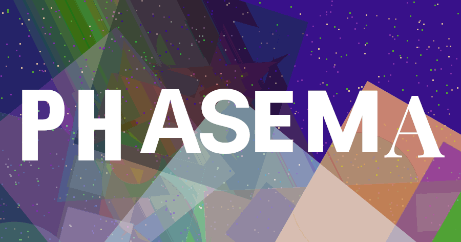

<p align="center">
  
  <h1 align="center">phasema</h1>
</p>


Generative image and animated banner engine for Node.js.

## Examples

````bash
# Generate 10 static PNG compositions
npx tsx src/cli.ts generate

# Generate an animated banner GIF at 60 fps
npx tsx src/cli.ts banner --fps 60 --duration 3

# Custom banner at 120 fps with 8 workers
npx tsx src/cli.ts banner --fps 120 --duration 3 --workers 8 --sample 15

# Show all commands and flags
npx tsx src/cli.ts helpEOF
echo "2 OK"
cat > README.md << 'EOF'
<p align="center">
  
  <h1 align="center">phasema</h1>
</p>


Generative image and animated banner engine for Node.js.

## Examples

```bash
# Generate 10 static PNG compositions
npx tsx src/cli.ts generate

# Generate an animated banner GIF at 60 fps
npx tsx src/cli.ts banner --fps 60 --duration 3

# Custom banner at 120 fps with 8 workers
npx tsx src/cli.ts banner --fps 120 --duration 3 --workers 8 --sample 15

# Show all commands and flags
npx tsx src/cli.ts help

## Related

- [@napi-rs/canvas](https://github.com/Brooooooklyn/canvas) - Native canvas for Node.js
- [sharp](https://github.com/lovell/sharp) - High-performance image processing
- [piscina](https://github.com/piscinajs/piscina) - Worker thread pool
- [@gomander/napi-gif-encoder](https://github.com/gomander/napi-gif-encoder) - Native GIF encoder

## Caught a Bug?

1. [Fork](https://help.github.com/articles/fork-a-repo/) this repository to your own GitHub account and then [clone](https://help.github.com/articles/cloning-a-repository/) it to your local device
2. Install the dependencies: `npm install`
3. Run the test suite: `npm test`
4. Open a pull request with a clear description of the change

## License

BSD-3-Clause. See [LICENSE](./LICENSE) for details.

## Related

- [@napi-rs/canvas](https://github.com/Brooooooklyn/canvas) - Native canvas for Node.js
- [sharp](https://github.com/lovell/sharp) - High-performance image processing
- [piscina](https://github.com/piscinajs/piscina) - Worker thread pool
- [@gomander/napi-gif-encoder](https://github.com/gomander/napi-gif-encoder) - Native GIF encoder

## Caught a Bug?

1. [Fork](https://help.github.com/articles/fork-a-repo/) this repository to your own GitHub account and then [clone](https://help.github.com/articles/cloning-a-repository/) it to your local device
2. Install the dependencies: `npm install`
3. Run the test suite: `npm test`
4. Open a pull request with a clear description of the change

## License

BSD-3-Clause. See [LICENSE](./LICENSE) for details.
````
