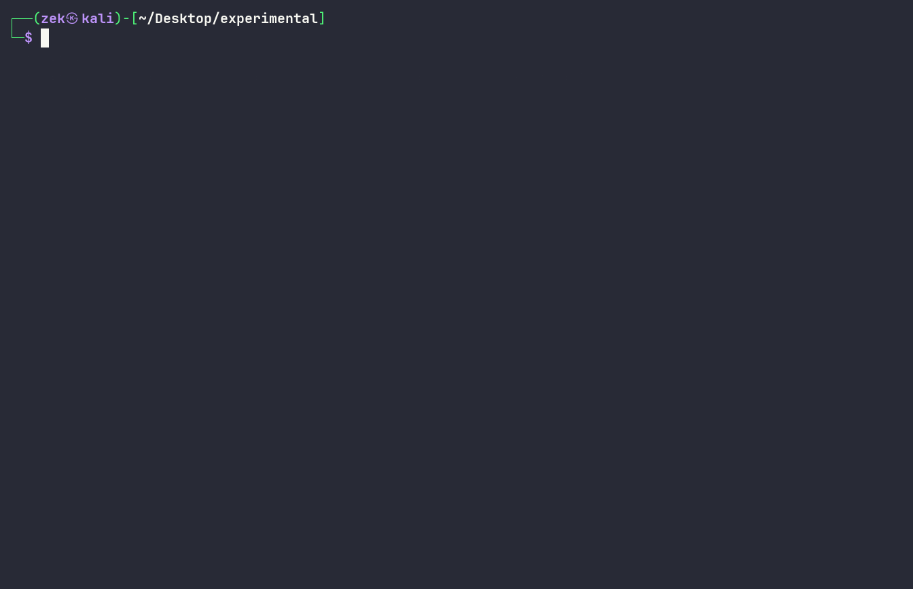

# phasema

Generative image and animated banner engine for Node.js.

## Features

- Procedural pixel layers with deterministic randomness
- Animated GIF banners with per-letter variable typography
- Parallel frame rendering via worker threads (piscina)
- High-performance native GIF encoding
- Structured logging with colored CLI output
- Optional Pexels integration with procedural fallback
- Reproducible output through seed-based randomness

## Requirements

- Node.js >= 22
- TypeScript 7+

## Showcase



## Install

```
npm install
```

## Usage

Generate 10 static compositions:

```
npm run generate
```

Generate an animated banner GIF at 60 fps:

```
npm run generate:banner
```

Custom banner at 120 fps with 8 workers:

```
npx tsx src/cli.ts banner --fps 120 --duration 3 --workers 8
```

Show help:

```
npx tsx src/cli.ts help
```

## CLI Flags

| Flag               | Default | Description                    |
| ------------------ | ------- | ------------------------------ |
| --fps <n>          | 60      | Frames per second (banner)     |
| --duration <n>     | 5       | Duration in seconds (banner)   |
| --workers <n>      | 4       | Worker threads (banner)        |
| --count <n>        | 10      | Number of results (generate)   |
| --size <n>         | 512     | Canvas size (generate)         |
| --no-background    | false   | Disable background composition |
| --background-count | 6       | Number of background images    |

## Library usage

```ts
import { generatePixelLayer, compose, generateFramesParallel, registerAllFonts } from "phasema";
```

## Architecture

```
src/
  banner/        animated banner pipeline
    worker.ts             per-frame worker
    parallel-composer.ts  piscina orchestration
    gif-encoder.ts        native GIF encoding
  composition/   layer composition
  core/          shared types, defaults, logger, CLI theme
  pixels/        procedural pixel layer generator
  stock/         stock and procedural image sources
  utils/         deterministic random utilities
  cli.ts         command-line interface
```

## License

ISC
